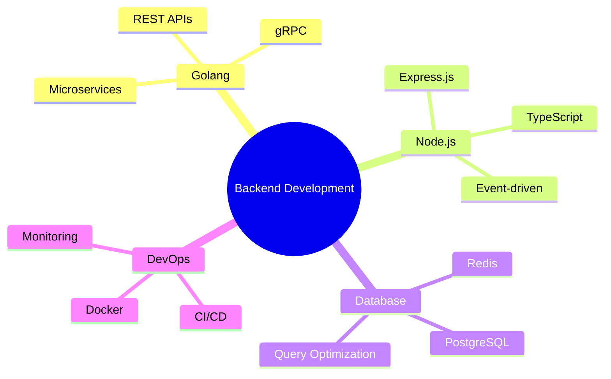

<div align="center">

```
____       _     __     ___      _     _____ _                      
| __ ) _   _(_)   / / /\  / (_)  _| |_  |_   _| |__   __ _ _ __   __ _ 
|  _ \| | | | |  / / /  \ | |\ \/ / _ \   | | | '_ \ / _` | '_ \ / _` |
| |_) | |_| | | / / / /\ \| | >  <  __/   | | | | | | (_| | | | | (_| |
|____/ \__,_|_|/_/ /_/  \_\_|/_/\_\___|   |_| |_| |_|\__,_|_| |_|\__, |
                                                                   |___/ 
```


</div>

---

## 🚀 About Me

```golang
package main

type Developer struct {
    Name           string
    Role           string
    Location       string
    Languages      []string
    Technologies   []string
    CurrentFocus   string
    LearningNext   []string
    Hobbies        []string
}

func main() {
    me := Developer{
        Name:         "Bùi Việt Thắng",
        Role:         "Backend Developer",
        Location:     "Hanoi, Vietnam 🇻🇳",
        Languages:    []string{"Go", "JavaScript", "TypeScript", "Python"},
        Technologies: []string{"Docker", "PostgreSQL", "Redis", "Microservices"},
        CurrentFocus: "Building scalable backend systems",
        LearningNext: []string{"Kubernetes", "gRPC", "System Design"},
        Hobbies:      []string{"Coding", "Automation", "Problem Solving"},
    }
    
    fmt.Printf("👨‍💻 %s - %s\n", me.Name, me.Role)
}
```

<div align="center">

### 💼 What I Do

</div>

- 🔧 Build **robust and scalable** backend systems
- ⚡ Focus on **performance optimization** and **clean architecture**
- 🤖 Love **automation** and creating developer tools
- 📚 Constantly **learning** and improving my craft
- 🎯 Aiming to become a **well-rounded software engineer**

---

## 🛠️ Tech Stack

<div align="center">

### Languages


### Frameworks & Runtime


### Databases


### DevOps & Tools


</div>

---

## 📊 GitHub Statistics

<div align="center">
  
  
</div>

<div align="center">
  
  
</div>

---

## 🏆 GitHub Trophies

<div align="center">
  


</div>

---

## 📂 Featured Projects

<div align="center">

<a href="https://github.com/BuiVietThang/ASM2">
  
</a>

<a href="https://github.com/BuiVietThang/DuAnDemo">
  
</a>

</div>

---

## 🎯 Current Focus



---

## 📈 Contribution Graph

<div align="center">


</div>

---

## 💭 Dev Quote

<div align="center">


</div>

---

## 🤝 Connect with Me

<div align="center">

[](https://github.com/BuiVietThang)
[](mailto:your-email@example.com)
[](https://linkedin.com/in/yourprofile)
[](https://yourportfolio.com)

</div>

---

<div align="center">

### 💡 "Code is not just to run — it's to scale, maintain, and serve long-term."


**⭐ From [BuiVietThang](https://github.com/BuiVietThang) - Let's build something amazing together!**

</div>
